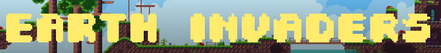

# Earth Invaders 🌍

Side Scrolling Shooter Game ✨

[](https://www.python.org/)




## Getting Started

These instructions will get you a copy of the project up and running on your local machine for development and testing purposes. See below for prerequisite libraries and notes on how to deploy the project on a live system.

`git clone https://github.com/mahirahman/earth-invaders --branch 2.0.0`

### Prerequisites

```
Python 3.6+
Pygame 1.9.5
PyTMX 3.21.7
PyTweening 1.0.3
```

## Built With

* [Python 3.7](https://www.python.org) - Programming Language
* [Pygame](https://www.pygame.org) - Game Library
* [pyTMX](https://pytmx.readthedocs.io/en/latest) - Render Tiled Maps
* [PyTweening](https://pypi.org/project/PyTweening) - Tween animations for Items
* [Tiled](https://www.mapeditor.org) - Create Tiled Maps
* [bfxr](https://www.bfxr.net) - Sound Effects

## Versioning

We use [SemVer](http://semver.org/) for versioning.

## License

* [General Public License v2.0](https://github.com/mahirahman/Earth-Invaders/blob/master/LICENSE)

## Modules From

* [DaFluffyPotato - Text Render](https://github.com/DaFluffyPotato)
* [Nearoo - Text Input](https://github.com/Nearoo/pygame-text-input)


## Authors

* **Mahi Rahman**
* **Son Tran**
